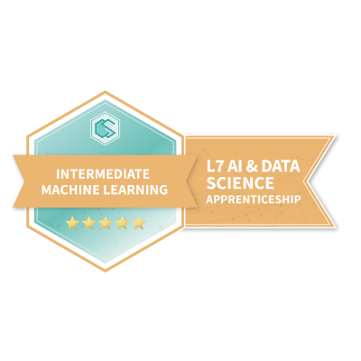
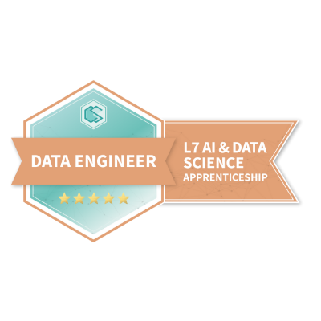
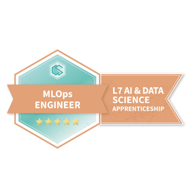
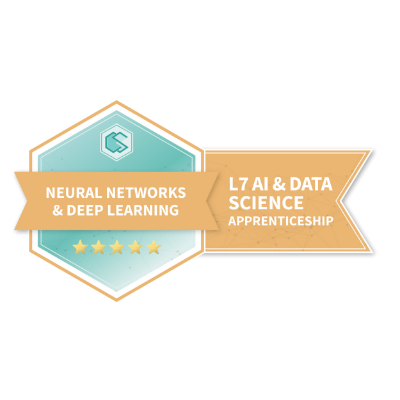

# L7(master level) AI & Data Science Apprenticeship
## Background
due to previous experience with AI and Python at 18 a started a masters level Apprenticeship degree after completing 3 months of the L4 version in a day. I completed it in 2023 at 20
## Diploma

## badges from course
- https://www.credential.net/fa0cdaea-f0b0-4734-ae44-d9ce210218fc - L7 AI & Data Science Apprenticeship - Intermediate Machine Learning
- 
- https://www.credential.net/65d6994d-931e-4cad-b1fb-f2be87a1e00c - L7 AI & Data Science Apprenticeship - Data Science Foundations
- 
- https://www.credential.net/97550202-90ec-4fed-8e84-126e831a9e3b - L7 AI & Data Science Apprenticeship - Machine Learning Foundations
- 
- https://www.credential.net/3cb81e09-61b3-4208-bbec-46c4e5fea31e - L7 AI & Data Science Apprenticeship - Explainable AI
- 
- https://www.credential.net/57a23bb3-18e8-411b-a4c9-6291cd371aad - L7 AI & Data Science Apprenticeship - Data Engineer
- 
- https://www.credential.net/41bd4172-1dc6-4597-adc2-33ca6868ca12 - L7 AI & Data Science Apprenticeship - MLOps Engineer
- 
- https://www.credential.net/62f52b13-4d7c-4b75-a453-fb6e0a7128fc - L7 AI & Data Science Apprenticeship - Neural Networks & Deep Learning
- 
